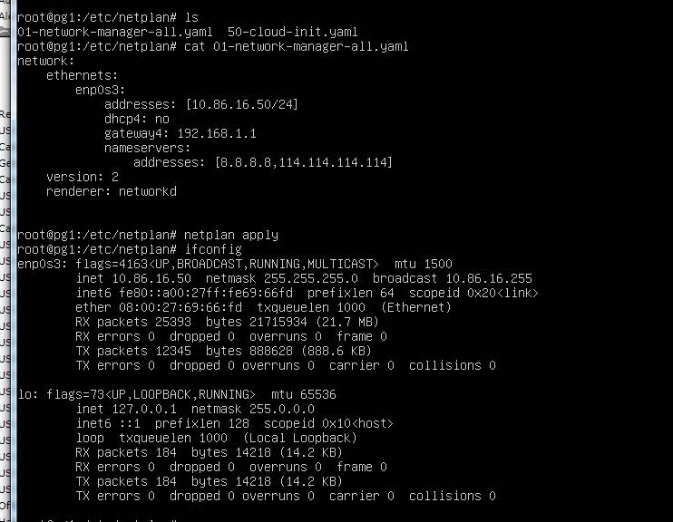

## 设置静态(固定)IP FOR Ubuntu18.04

由于资源有限，我的Ubuntu是用VirtualBox在Windows上建的一个虚机。为了方便，因此需要设置静态(固定)IP.
因为Ubuntu18.04采用的是netplan来管理network。所以可以在/etc/netplan/目录下创建 
一个以yaml结尾的文件。比如01-network-manager-all.yaml文件。 
文件内容如下:

```shell
network:
    version: 2
    renderer: networkd
    ethernets:
        enp3s0:
            dhcp4: no
            addresses: [10.86.16.50/24]
            gateway4:  192.168.1.1
            nameservers:
                addresses: [8.8.8.8, 114.114.114.114]
```


保存，然后使用以下命令使配置即时生效:

```shell

netplan apply
```

整个配置过程如下图:

