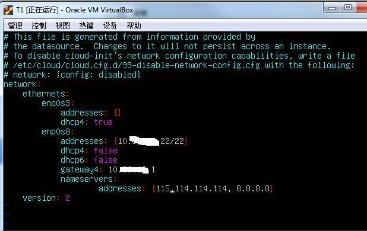

## 设置静态(固定)IP FOR Ubuntu18.04

由于资源有限，我的Ubuntu是用VirtualBox在Windows上建的一个虚机。为了方便，因此需要设置静态(固定)IP.
因为Ubuntu18.04采用的是netplan来管理network。所以可以在/etc/netplan/目录下创建 
一个以yaml结尾的文件。比如01-network-manager-all.yaml文件。 
文件内容如下:

```shell
network:
    version: 2
    
    ethernets:
        enp0s8:
            dhcp4: false
            dhcp6: false                        
            addresses: [10.86.16.50/24]
            gateway4:  10.86.16.1
            nameservers:
                addresses: [114.114.114.114, 8.8.8.8]
```


保存，然后使用以下命令使配置即时生效:

```shell

netplan apply
```

整个配置过程如下图:




其中，gateway可以通过以下命令获得

```shell
route -n
```


nameservers:可以不填，默认使用主机的dns,或者填[114.114.114.114, 8.8.8.8]都可以。

也可以通过以下命令得到自身的dns:

```shell
cat /etc/resolv.conf
```


