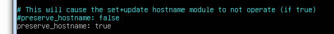
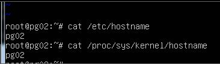

## 修改ubuntu 18.04的主机名(hostname)

ubuntu 18.04不能直接修改/etc/hostname中主机名称,重启后又恢复到安装时设置的主机名称.正确的修改步骤如下:

Step1: 首先修改 /etc/cloud/cloud.cfg

```shell
sudo vim /etc/cloud/cloud.cfg
#找到preserve_hostname: false修改为preserve_hostname: true
```



Step2: 修改主机名hostname （永久)

```shell
#修改主机名(临时)
#hostname master

#修改主机名(永久)
sudo vim /etc/hostname
#然后改为需要的主机名后存盘退出

#映射主机名
sudo vim /etc/hosts
#192.168.1.xxx 主机名

sudo reboot
```

重启后新的主机名就生效了,但是要注意不能将还原preserve_hostname: false,否则下次重新后主机名又被覆盖了.


Step3: 查看修改后的主机名hostname

```shell
#查看主机名
uname -a
#主机名实际存储在/proc/sys/kernel/hostname,但是不能修改
cat /proc/sys/kernel/hostname
```




