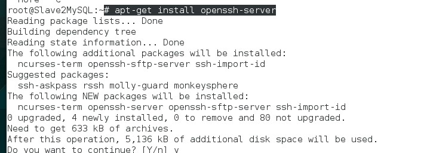
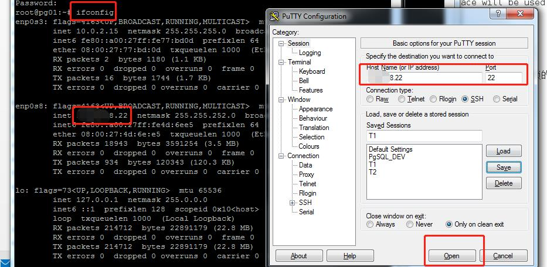

## putty 连接Ubuntu18.04(putty connect Linux)

Step1: 下载Putty

PuTTY 是一款集成虚拟终端、系统控制台和网络文件传输为一体的免费且开源的程序。它支持多种网络协议，包括：SCP、SSH、Telnet、rlogin 和原始的套接字连接。它也可以连接到串行端口。其软件名字“PuTTY”没有特殊含义。较早的版本仅支持 Windows 平台，后陆续增加对各类 Unix 平台和 Mac OS X 的支持。除了官方版本外，有许多第三方的团体或个人将 PuTTY 移植到其他平台上，像是以 Symbian 为基础的移动电话.

PuTTY 包含以下特性：

支持 IPv6 连接
可以控制 SSH 连接时加密协议的种类。
目前有 3DES、AES、Blowfish、DES（不建议使用）及 RC4。
CLI 版本的 SCP 及 SFTP Client，分别叫做 pscp 与 psftp。
内置 SSH Forwarding 的功能，包括 X11 Forwarding。
完全模拟 xterm、VT102 及 ECMA-48 终端机的能力。
支持公钥认证。

进入https://www.putty.org/ 点击Download进入下列网址，选择相应的版本进行下载，双击在windows上安装。

https://www.chiark.greenend.org.uk/~sgtatham/putty/latest.html


Step2:修改 ubuntu18.04配置

修改 PermitRootLogin 为 yes

```shell
vi /etc/ssh/sshd_config
# The strategy used for options in the default sshd_config shipped with
# OpenSSH is to specify options with their default value where
# possible, but leave them commented.  Uncommented options override the
# default value.

Port 22
# Authentication:

#LoginGraceTime 2m
#PermitRootLogin prohibit-password
PermitRootLogin yes

```


Step3:  Check if your linux server installed openssh-server

``` shell
sshd
```


Step4: Install openssh-server

```shell
apt-get install openssh-server
```



若出现以下问题：
E:Could not get lock /var/lib/apt/lists/lock -
open (11: Resource temporarily unavailable)    
出现这个问题的原因可能是有另外一个程序正在运行，导致资源被锁不可用。而导致资源被锁的原因，可能是上次安装时没正常完成，而导致出现此状况。
解决方法：输入以下命令
sudo rm /var/cache/apt/archives/lock
sudo rm /var/lib/dpkg/lock
之后再安装想装的包，即可解决


Step5: Connect Linux server with Putty

Get linux server ip by ifconfig command and connect with putty:


