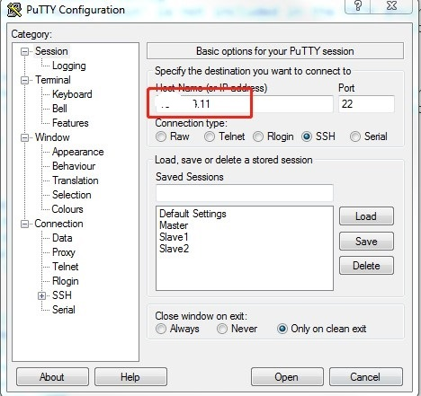
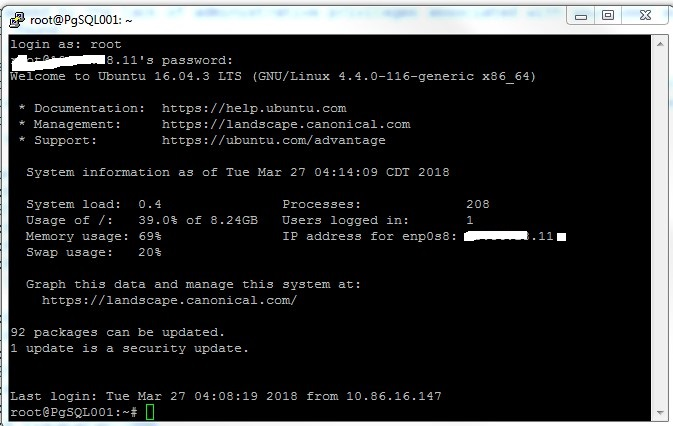

## Install PostgreSQL on Ubuntu 18.04


**PostgreSQL** is a powerful, open source **object-relational database system** ( ORDBMS ). Unlike other relational database systems, **PostgreSQL** allows users to create unique operators, complex data types, aggregate functions, data type conversion character, and other various database objects through the **SQL** function.

In this article, we are going to show you how to install **PostgreSQL 10** database on Ubuntu 16.04 LTS. The latest stable release PostgreSQL 10 includes such enhancements as

-  Logical replication using publish/subscribe
- Declarative table partitioning
- Improved query parallelism
- Significant general performance improvements
- Stronger password authentication based on SCRAM-SHA-256
- Improved monitoring and control


# Step 1: Add PostgreSQL Apt Repository


– Add PostgreSQL apt repository

```
# echo 'deb http://apt.postgresql.org/pub/repos/apt/ xenial-pgdg main' >> /etc/apt/sources.list.d/pgdg.list
```

– Import the repository signing key, and update the package lists

```
# wget --quiet -O - https://www.postgresql.org/media/keys/ACCC4CF8.asc | sudo apt-key add -
```

##  

# Step 2: Install PostgreSQL

```
# sudo apt-get update
# sudo apt-get install postgresql-10
```

##  

# Step 3: Connect to PostgreSQL

– After installing PostgreSQL database server, by default PostgreSQL, will create a system account user ‘postgres’ and a user named ‘postgres’ with role ‘postgres’.

– To connect use the following commands:

```
# sudo su - postgres
# psql 
```

# Step 4: Usage Examples

– check log info


```
# \conninfo
```


– Change the password of postgres role

\# \password postgres

 

– List databases

\# \list  

\# \l

​                                                  

– Connect to a database:

\# \c database_name

​                              

 

– List all the tables

```
# \dt
```

​                              

– Create database

```
# create database test;
```

​                            

--Create table

```
# \c test
# create table t1(id int primary key,
#                 name varchar(10),
#     content text,
#     create_date date,
#     create_time time
# );
```

​                              

--Insert into data 

```
# insert into t1(id,name,content,create_date,create_time) values(1,'hongdou','SSIS Error Code DTS_E_PROCESSINPUTFAILED. ',current_date,current_time);
```

​                              

--Query data

\# select * from t1 where id=2;

 

​                              

 

--Exit the PostgreSQL

```
# \q
```

 

 

 

 

 

# Step 5:Secure Local PostgreSQL 

PostgreSQL uses peer authentication by default. This means database connections will be granted to local system users that own or have privileges on the database being connected to. Such authentication is useful in cases where a particular system user will be running a local program (e.g. scripts, CGI/FastCGI processes owned by separate users, etc.), but for greater security, you may wish to require passwords to access your databases.

Commands in this section should be run as the postgres Linux user unless otherwise specified.

Edit the /etc/postgresql/9.5/main/pg_hba.conf file, under the # "local" is for Unix domain socket connections only header:

Replace peer with md5 on this line to activate password authentication using an MD5 hash.

 

```
$ cd /etc/postgresql/10/main/
$ vi pg_hba.conf
 
```

   

​                            

 

Restart PostgreSQL and switch back to the postgres user:

```
$ systemctl restart postgresql.service
```

 

As postgres, connect to the test database as the examplerole PostgreSQL user:

```
psql -U examplerole -W mytestdb
```

You will be prompted to enter the password for the examplerole user and given psql shell access to the database. When using a database, you may check access privileges for each of its tables with the \z command.

 

```
~# su - postgres
$ psql -U postgres -W test
```

   

​                            

# Step 6:Secure Remote PostgreSQL With pgAdmin

PostgreSQL listens for connections on localhost and it is not advised to reconfigure it to listen on public IP addresses. If you would like to access your databases remotely using a graphical tool, please follow one of these guides:

**Install pgAdmin**

Visit the [pgAdmin download page](https://www.pgadmin.org/download/windows4.php) to obtain the most recent version of the program. Save the installer to your desktop and launch it. You’ll be greeted with the following screen; click “Next” to continue.

​                              

 

**Configure SSH Tunnel**[**Permalink**](https://linode.com/docs/databases/postgresql/how-to-access-postgresql-database-remotely-using-pgadmin-on-windows/#configure-ssh-tunnel)

While PostgreSQL supports SSL connections, it is not advisable to instruct it to listen on public IP addresses unless absolutely necessary. For this reason, you’ll be using PuTTY (a free SSH client) to create a secure SSH tunnel to your Linode. Obtain the program by visiting the [PuTTY download page](http://www.chiark.greenend.org.uk/~sgtatham/putty/download.html). Save it to your desktop and launch it. You’ll be greeted with the “Session” dialog shown below; enter your Linode’s IP address or FQDN in the “Host Name” field.

 

​                            

   

Open the “Connection -> SSH -> Tunnels” screen. Enter “5433” in the “Source port” field. Although PostgreSQL uses 5432 for TCP connections, you’ll want to specify 5433 as the port number in case you decide to install PostgreSQL locally later on. Enter “127.0.0.1:5432” in the “Destination” field, and click the “Add” button.

​                              

The “Forwarded ports” list should now contain an entry like the one shown below.

​                              

 

Click the “Open” button to start your connection. If you haven’t logged into your Linode with PuTTY before, you will receive a warning similar to the following:

​                             

PuTTY is asking you to verify that the server you’re logging into is who it says it is. This is due to the possibility that someone could be eavesdropping on your connection and posing as the server you are trying to log into. You need some “out of band” method to compare the key fingerprint presented to PuTTY with the fingerprint of the public key on the server you wish to log into. You may do so by logging into your Linode via [Lish](https://linode.com/docs/networking/using-the-linode-shell-lish/) and executing the following command:

```
ssh-keygen -l -f /etc/ssh/ssh_host_rsa_key.pub
```

If the fingerprints match, click “Yes” to accept the warning and cache this host key in the registry. You won’t receive further warnings unless the key presented to PuTTY changes for some reason; typically, this should only happen if you reinstall the remote server’s operating system. If you should receive this warning again from a system you already have the host key cached on, you should not trust the connection and investigate matters further.

You may log into your Linode with any user account you have configured on it. Next, you’ll use pgAdmin to connect to PostgreSQL through the tunnel.

​              

 

**Use pgAdmin**[**Permalink**](https://linode.com/docs/databases/postgresql/how-to-access-postgresql-database-remotely-using-pgadmin-on-windows/#use-pgadmin)

 

Launch pgAdmin and you’ll be presented with a default view containing no servers. Click “File -> Add Server” as shown below.

   

   

 

​                              

 

 

 

You will be presented with a full view of the databases that your user account has access to.

   

<https://linode.com/docs/databases/postgresql/how-to-install-postgresql-on-ubuntu-16-04/> 