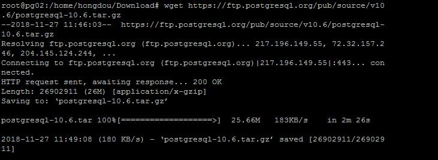
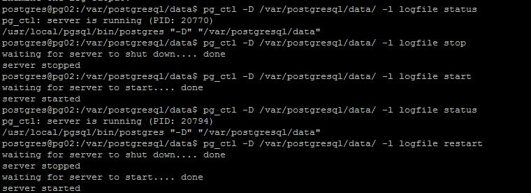

# Ubuntu 18.04编译安装Postgresql


Step1:下载源码

可以访问下列网址下载相应的源码安装包:

https://ftp.postgresql.org/pub/source/

```shell
wget https://ftp.postgresql.org/pub/source/v10.6/postgresql-10.6.tar.gz
```




Step2:解压

```shell
tar zxvf postgresql-10.6.tar.gz
```


Step3:安装依赖包

如果没有安装gcc compiler,则会出现下列错误:


Install gcc 和其他依赖包:

```shell
apt-get install gcc -y
apt-get install libreadline-dev -y
apt-get install zlib1g-dev -y
apt-get install make -y

```


Step4:编译安装:

```shell
./configure

make -j8

sudo make install
```


Step5:创建postgres用户并给文件夹授权

```shell
adduser postgres
```


```SHELL
su root
chown postgres:postgres /var/postgresql -R
chown postgres:postgres /usr/local/pgsql/ -R

```


Step6:切换用户配置环境变量

```shel
su - postgres

export PATH=/usr/local/pgsql/bin:$PATH
```


Step7: 初始化数据库

```shell
su - postgres
initdb -D /var/postgresql/data
```


Step8:启动服务

```shell
pg_ctl -D /var/postgresql/data/ -l logfile start
pg_ctl -D /var/postgresql/data/ -l logfile status 
```




Step9:测试

```sql
postgres@pg02:/var/postgresql/data$ psql
psql (10.6)
Type "help" for help.

postgres=# create database test;
CREATE DATABASE
postgres=# \c
You are now connected to database "postgres" as user "postgres".
postgres=# \c test
You are now connected to database "test" as user "postgres".
test=# create table test (id integer, name text);
CREATE TABLE
test=#  insert into test values (1,'hongdou');
INSERT 0 1
test=# select * from test ;
 id |  name
----+---------
  1 | hongdou
(1 row)

```


Add a new user u1 and connect by u1:

```sql
postgres@pg02:/var/postgresql/data$ psql -h localhost -U postgres -d test -W
Password for user postgres:
psql (10.6)
Type "help" for help.

test=# CREATE USER U1 WITH PASSWORD 'U1_123456';
CREATE ROLE
test=# grant all privileges on database test to u1;
GRANT
test=# \q
postgres@pg02:/var/postgresql/data$ psql -h localhost -p 5432 -U u1 -d test -W
Password for user u1:
psql (10.6)
Type "help" for help.

test=> \q

```


**Step10:禁用postgres本地连接，允许远程连接**

修改pg_hba.conf如下:

```:accept:
local   all             all                                     peer
# IPv4 local connections:
host    all             all             127.0.0.1/32            trust
# IPv6 local connections:
host    all             all             ::1/128                 md5
# Allow replication connections from localhost, by a user with the
# replication privilege.
local   replication     all                                     trust
host    replication     all             127.0.0.1/32            trust
host    replication     all             ::1/128                 trust
#host   all             all             10.86.16.147/32         md5
host    all             all             all                     md5

```


修改postgresql.conf

```:accept:
listen_addresses = '*'          # what IP address(es) to listen on;
                                        # comma-separated list of addresses;
                                        # defaults to 'localhost'; use '*' for all
                                        # (change requires restart)
port = 5432                             # (change requires restart)

```


重启服务:

```:accept:
pg_ctl -D /var/postgresql/data/ -l logfile restart
```


**Step11:pgadmin连接**

