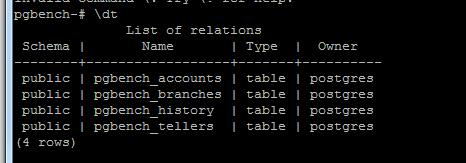
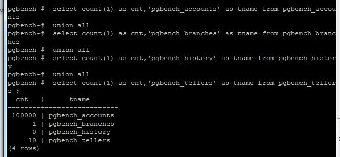

# Postgres测试工具pgbench

## 1.Install


### #1.1如果是源码安装的话，需要单独再安装一遍

进入源码安装包,编译,安装

```
[postgres@localhost  ~]$ cd postgresql-10.6/contrib/pgbench/
[postgres@localhost  pgbench]$ ll
total 164
-rw-r--r--. 1 postgres postgres   538 Dec  1  2011 Makefile
-rwxrwxr-x. 1 postgres postgres 50203 Apr 26 23:50 pgbench
-rw-r--r--. 1 postgres postgres 61154 Dec  1  2011 pgbench.c
-rw-rw-r--. 1 postgres postgres 47920 Apr 26 23:50 pgbench.o
[postgres@localhost  pgbench]$make all
[postgres@localhost  pgbench]$make install
```

安装完毕以后可以在bin文件夹下看到新生成的pgbench文件

```
[postgres@localhost  bin]$ ll $PGHOME/bin pgbench
```


#1.2 如果是安装包安装的话，那么默认已经安装好了。


```shell
root@pg01:/# whereis pgbench
pgbench: /usr/bin/pgbench 
```


change to user postgres and login psql ,create a database named pgbench

```shell
postgres@pg01:/root$ psql -h localhost -U postgres -d postgres -W
could not change directory to "/root": Permission denied
Password for user postgres:
psql (10.6 (Ubuntu 10.6-0ubuntu0.18.10.1))
SSL connection (protocol: TLSv1.3, cipher: TLS_AES_256_GCM_SHA384, bits: 256, compression: off)
Type "help" for help.
postgres=# create database pgbench;
CREATE DATABASE
postgres=# \c pgbench
Password for user postgres:
SSL connection (protocol: TLSv1.3, cipher: TLS_AES_256_GCM_SHA384, bits: 256, compression: off)
You are now connected to database "pgbench" as user "postgres".


```


## 2.pgbench --help

```sh

postgres@pg01:/$ pgbench --help
pgbench is a benchmarking tool for PostgreSQL.

Usage:
  pgbench [OPTION]... [DBNAME]

Initialization options:
  -i, --initialize         invokes initialization mode
  -F, --fillfactor=NUM     set fill factor
  -n, --no-vacuum          do not run VACUUM after initialization
  -q, --quiet              quiet logging (one message each 5 seconds)
  -s, --scale=NUM          scaling factor
  --foreign-keys           create foreign key constraints between tables
  --index-tablespace=TABLESPACE
                           create indexes in the specified tablespace
  --tablespace=TABLESPACE  create tables in the specified tablespace
  --unlogged-tables        create tables as unlogged tables

Options to select what to run:
  -b, --builtin=NAME[@W]   add builtin script NAME weighted at W (default: 1)
                           (use "-b list" to list available scripts)
  -f, --file=FILENAME[@W]  add script FILENAME weighted at W (default: 1)
  -N, --skip-some-updates  skip updates of pgbench_tellers and pgbench_branches
                           (same as "-b simple-update")
  -S, --select-only        perform SELECT-only transactions
                           (same as "-b select-only")

Benchmarking options:
  -c, --client=NUM         number of concurrent database clients (default: 1)
  -C, --connect            establish new connection for each transaction
  -D, --define=VARNAME=VALUE
                           define variable for use by custom script
  -j, --jobs=NUM           number of threads (default: 1)
  -l, --log                write transaction times to log file
  -L, --latency-limit=NUM  count transactions lasting more than NUM ms as late
  -M, --protocol=simple|extended|prepared
                           protocol for submitting queries (default: simple)
  -n, --no-vacuum          do not run VACUUM before tests
  -P, --progress=NUM       show thread progress report every NUM seconds
  -r, --report-latencies   report average latency per command
  -R, --rate=NUM           target rate in transactions per second
  -s, --scale=NUM          report this scale factor in output
  -t, --transactions=NUM   number of transactions each client runs (default: 10)
  -T, --time=NUM           duration of benchmark test in seconds
  -v, --vacuum-all         vacuum all four standard tables before tests
  --aggregate-interval=NUM aggregate data over NUM seconds
  --log-prefix=PREFIX      prefix for transaction time log file
                           (default: "pgbench_log")
  --progress-timestamp     use Unix epoch timestamps for progress
  --sampling-rate=NUM      fraction of transactions to log (e.g., 0.01 for 1%)

Common options:
  -d, --debug              print debugging output
  -h, --host=HOSTNAME      database server host or socket directory
  -p, --port=PORT          database server port number
  -U, --username=USERNAME  connect as specified database user
  -V, --version            output version information, then exit
  -?, --help               show this help, then exit


```



**说明：**
a.这里使用的是默认的参数值,带-s 参数时可指定测试数据的数据量,-f可以指定测试的脚本,这里用的是默认脚本
b.不要在生产的库上做，新建一个测试库，当生产上有同名的测试表时将被重置


## 3.初始化测试数据

Init pgbench:

```shell
root@pg01:/# su postgres
postgres@pg01:/$ pgbench -i pgbench
creating tables...
100000 of 100000 tuples (100%) done (elapsed 0.36 s, remaining 0.00 s)
vacuum...
set primary keys...
done.

```

```sql
 select count(1) as cnt,'pgbench_accounts' as tname from pgbench_accounts
 union all 
 select count(1) as cnt,'pgbench_branches' as tname from pgbench_branches
 union all 
 select count(1) as cnt,'pgbench_history' as tname from pgbench_history 
 union all 
 select count(1) as cnt,'pgbench_tellers' as tname from pgbench_tellers ;
 
 pgbench=# \d+ pgbench_accounts
                                  Table "public.pgbench_accounts"
  Column  |     Type      | Collation | Nullable | Default | Storage  | Stats target | Description
----------+---------------+-----------+----------+---------+----------+--------------+-------------
 aid      | integer       |           | not null |         | plain    |              |
 bid      | integer       |           |          |         | plain    |              |
 abalance | integer       |           |          |         | plain    |              |
 filler   | character(84) |           |          |         | extended |              |
Indexes:
    "pgbench_accounts_pkey" PRIMARY KEY, btree (aid)
Options: fillfactor=100

pgbench=# \d+ pgbench_branches
                                  Table "public.pgbench_branches"
  Column  |     Type      | Collation | Nullable | Default | Storage  | Stats target | Description
----------+---------------+-----------+----------+---------+----------+--------------+-------------
 bid      | integer       |           | not null |         | plain    |              |
 bbalance | integer       |           |          |         | plain    |              |
 filler   | character(88) |           |          |         | extended |              |
Indexes:
    "pgbench_branches_pkey" PRIMARY KEY, btree (bid)
Options: fillfactor=100

pgbench=# \d+ pgbench_history
                                        Table "public.pgbench_history"
 Column |            Type             | Collation | Nullable | Default | Storage  | Stats target | Description
--------+-----------------------------+-----------+----------+---------+----------+--------------+-------------
 tid    | integer                     |           |          |         | plain    |              |
 bid    | integer                     |           |          |         | plain    |              |
 aid    | integer                     |           |          |         | plain    |              |
 delta  | integer                     |           |          |         | plain    |              |
 mtime  | timestamp without time zone |           |          |         | plain    |              |
 filler | character(22)               |           |          |         | extended |              |

pgbench=# \d+ pgbench_tellers
                                  Table "public.pgbench_tellers"
  Column  |     Type      | Collation | Nullable | Default | Storage  | Stats target | Description
----------+---------------+-----------+----------+---------+----------+--------------+-------------
 tid      | integer       |           | not null |         | plain    |              |
 bid      | integer       |           |          |         | plain    |              |
 tbalance | integer       |           |          |         | plain    |              |
 filler   | character(84) |           |          |         | extended |              |
Indexes:
    "pgbench_tellers_pkey" PRIMARY KEY, btree (tid)
Options: fillfactor=100


```




## 4.测试过程

### 4.1 1 session,1 thread

```shell
postgres@pg01:/home/pgbench_test$ nohup pgbench -c 1 -T 20 -r pgbench > file2.out 2>&1
postgres@pg01:/home/pgbench_test$ cat file2.out
nohup: ignoring input
starting vacuum...end.
transaction type: <builtin: TPC-B (sort of)>
scaling factor: 1
query mode: simple
number of clients: 1
number of threads: 1
duration: 20 s
number of transactions actually processed: 6382
latency average = 3.134 ms
tps = 319.094728 (including connections establishing)
tps = 319.239778 (excluding connections establishing)
script statistics:
 - statement latencies in milliseconds:
         0.006  \set aid random(1, 100000 * :scale)
         0.002  \set bid random(1, 1 * :scale)
         0.001  \set tid random(1, 10 * :scale)
         0.001  \set delta random(-5000, 5000)
         0.089  BEGIN;
         0.384  UPDATE pgbench_accounts SET abalance = abalance + :delta WHERE aid = :aid;
         0.291  SELECT abalance FROM pgbench_accounts WHERE aid = :aid;
         0.316  UPDATE pgbench_tellers SET tbalance = tbalance + :delta WHERE tid = :tid;
         0.296  UPDATE pgbench_branches SET bbalance = bbalance + :delta WHERE bid = :bid;
         0.222  INSERT INTO pgbench_history (tid, bid, aid, delta, mtime) VALUES (:tid, :bid, :aid, :delta, CURRENT_TIMESTAMP);
         1.524  END;

```

```sql
pgbench=#  select count(1) as cnt,'pgbench_accounts' as tname from pgbench_accounts
 union all
 select count(1) as cnt,'pgbench_branches' as tname from pgbench_branches
 union all
 select count(1) as cnt,'pgbench_history' as tname from pgbench_history
 union all
 select count(1) as cnt,'pgbench_tellers' as tname from pgbench_tellers ;
  cnt   |      tname
--------+------------------
 100000 | pgbench_accounts
      1 | pgbench_branches
   6382 | pgbench_history
     10 | pgbench_tellers
(4 rows)

```


### 4.2 30 session,1 thread

```shel
postgres@pg01:/home$ cd pgbench_test/
postgres@pg01:/home/pgbench_test$ nohup pgbench -c 30 -T 20 -r pgbench > file.out 2>&1
postgres@pg01:/home/pgbench_test$ ls
file.out
postgres@pg01:/home/pgbench_test$ cat file.out
nohup: ignoring input
starting vacuum...end.
transaction type: <builtin: TPC-B (sort of)>
scaling factor: 1
query mode: simple
number of clients: 30
number of threads: 1
duration: 20 s
number of transactions actually processed: 4694
latency average = 129.125 ms
tps = 232.332519 (including connections establishing)
tps = 232.412774 (excluding connections establishing)
script statistics:
 - statement latencies in milliseconds:
         0.014  \set aid random(1, 100000 * :scale)
         0.006  \set bid random(1, 1 * :scale)
         0.006  \set tid random(1, 10 * :scale)
         0.003  \set delta random(-5000, 5000)
         0.225  BEGIN;
         0.115  UPDATE pgbench_accounts SET abalance = abalance + :delta WHERE aid = :aid;
         0.204  SELECT abalance FROM pgbench_accounts WHERE aid = :aid;
        89.852  UPDATE pgbench_tellers SET tbalance = tbalance + :delta WHERE tid = :tid;
        32.756  UPDATE pgbench_branches SET bbalance = bbalance + :delta WHERE bid = :bid;
         0.001  INSERT INTO pgbench_history (tid, bid, aid, delta, mtime) VALUES (:tid, :bid, :aid, :delta, CURRENT_TIMESTAMP);
         3.950  END;

```

```sql
pgbench=#  select count(1) as cnt,'pgbench_accounts' as tname from pgbench_accounts
 union all
 select count(1) as cnt,'pgbench_branches' as tname from pgbench_branches
 union all
 select count(1) as cnt,'pgbench_history' as tname from pgbench_history
 union all
 select count(1) as cnt,'pgbench_tellers' as tname from pgbench_tellers ;
  cnt   |      tname
--------+------------------
 100000 | pgbench_accounts
      1 | pgbench_branches
   4694 | pgbench_history
     10 | pgbench_tellers
(4 rows)

pgbench=# select * from pgbench_history order by mtime desc limit 5;
 tid | bid |  aid  | delta |           mtime            | filler
-----+-----+-------+-------+----------------------------+--------
   2 |   1 | 78537 |  -886 | 2018-12-27 10:11:36.156542 |
   1 |   1 | 19026 |  4075 | 2018-12-27 10:11:36.153631 |
   3 |   1 |  9964 | -4843 | 2018-12-27 10:11:36.149966 |
   2 |   1 | 14525 |  -263 | 2018-12-27 10:11:36.145046 |
   7 |   1 | 17745 |  -705 | 2018-12-27 10:11:36.143178 |
(5 rows)

```

### 

### 4.3 50 sessions,1 thread

```shell
postgres@pg01:/home/pgbench_test$ nohup pgbench -c 50 -T 20 -r pgbench > file_50_1.out 2>&1
postgres@pg01:/home/pgbench_test$ cat file_50_1.out
nohup: ignoring input
starting vacuum...end.
transaction type: <builtin: TPC-B (sort of)>
scaling factor: 1
query mode: simple
number of clients: 50
number of threads: 1
duration: 20 s
number of transactions actually processed: 4227
latency average = 241.290 ms
tps = 207.219914 (including connections establishing)
tps = 207.290971 (excluding connections establishing)
script statistics:
 - statement latencies in milliseconds:
         0.016  \set aid random(1, 100000 * :scale)
         0.005  \set bid random(1, 1 * :scale)
         0.006  \set tid random(1, 10 * :scale)
         0.004  \set delta random(-5000, 5000)
         0.773  BEGIN;
         0.155  UPDATE pgbench_accounts SET abalance = abalance + :delta WHERE aid = :aid;
         0.935  SELECT abalance FROM pgbench_accounts WHERE aid = :aid;
       189.363  UPDATE pgbench_tellers SET tbalance = tbalance + :delta WHERE tid = :tid;
        39.262  UPDATE pgbench_branches SET bbalance = bbalance + :delta WHERE bid = :bid;
         0.009  INSERT INTO pgbench_history (tid, bid, aid, delta, mtime) VALUES (:tid, :bid, :aid, :delta, CURRENT_TIMESTAMP);
         4.402  END;


```


### 4.4 99 sessions,1 thread

```shel
postgres@pg01:/home/pgbench_test$ nohup pgbench -c 99 -T 20 -r pgbench > file_99_1.out 2>&1
postgres@pg01:/home/pgbench_test$ cat file_99_1.out
nohup: ignoring input
starting vacuum...end.
transaction type: <builtin: TPC-B (sort of)>
scaling factor: 1
query mode: simple
number of clients: 99
number of threads: 1
duration: 20 s
number of transactions actually processed: 3569
latency average = 577.615 ms
tps = 171.394562 (including connections establishing)
tps = 171.451207 (excluding connections establishing)
script statistics:
 - statement latencies in milliseconds:
         0.017  \set aid random(1, 100000 * :scale)
         0.006  \set bid random(1, 1 * :scale)
         0.006  \set tid random(1, 10 * :scale)
         0.006  \set delta random(-5000, 5000)
         2.938  BEGIN;
         0.276  UPDATE pgbench_accounts SET abalance = abalance + :delta WHERE aid = :aid;
         2.503  SELECT abalance FROM pgbench_accounts WHERE aid = :aid;
       487.984  UPDATE pgbench_tellers SET tbalance = tbalance + :delta WHERE tid = :tid;
        47.018  UPDATE pgbench_branches SET bbalance = bbalance + :delta WHERE bid = :bid;
         0.008  INSERT INTO pgbench_history (tid, bid, aid, delta, mtime) VALUES (:tid, :bid, :aid, :delta, CURRENT_TIMESTAMP);
         5.193  END;


```

### 4.5 100 sessions,1 thread


```shel
postgres@pg01:/home/pgbench_test$ nohup pgbench -c 100 -T 20 -r pgbench > file_100_20.out 2>&1
postgres@pg01:/home/pgbench_test$ cat file_100_1.out
nohup: ignoring input
starting vacuum...end.
connection to database "pgbench" failed:
FATAL:  sorry, too many clients already
transaction type: <builtin: TPC-B (sort of)>
scaling factor: 1
query mode: simple
number of clients: 100
number of threads: 1
duration: 20 s
number of transactions actually processed: 0

```


超过100个会报错，因为数据库当前设置最大session是100

```sql
pgbench=# show max_connections;
 max_connections
-----------------
 100
(1 row)

```


## **5.说明** 

我们主要关心的是最后的输出报告中的TPS值，里面有两个,一个是包含网络开销(including),另一个是不包含网络开销的(excluding),这个值是反映的每秒处理的事务数，反过来也可以查出每个事务数所消耗的平均时间，一般认为能将硬件用到极致，速度越快越好。